# Đặc tả Kiến trúc SA Full-Stack & Kế hoạch Frontend Mobile-First (break_the_barriers)

Bản đặc tả thiết kế hệ thống và kế hoạch triển khai Frontend theo triết lý **Mobile-First (Ưu tiên thiết bị di động tối cao)**, đảm bảo giao diện đẹp mắt, tương tác mượt mà dưới 100ms, đồng bộ hoàn toàn với API Backend FastAPI và cơ sở dữ liệu PostgreSQL thực tế.

---

## 1. Sơ đồ Kiến trúc Hệ thống Full-Stack (Decoupled System Architecture)

Hệ thống được thiết kế theo mô hình **Client-Server phân tách (Decoupled)** kết hợp xử lý bất đồng bộ (Non-blocking Background Tasks) để tối ưu hóa hiệu năng trên thiết bị di động có cấu hình yếu:

```mermaid
sequenceDiagram
    autonumber
    actor User as Biên tập viên / Độc giả di động
    participant FE as Mobile-First Frontend (Dashboard/Reader)
    participant API as FastAPI Gateway (Port 8005)
    participant Worker as Background Tasks (FastAPI Engine)
    participant Poppler as Poppler pdftohtml (CLI)
    participant Gemini as Google Gemini 1.5 Flash (API)
    participant DB as PostgreSQL Database

    %% Upload & Extraction Process
    User->>FE: Kéo thả PDF lên Dashboard (Mobile Touch)
    FE->>API: POST /api/docs/upload (Multipart File)
    API->>DB: Ghi DBDocument record (Trạng thái: raw)
    API-->>FE: Trả về Metadata tài liệu (doc_id)
    
    FE->>API: POST /api/docs/{doc_id}/extract?async_mode=true
    API->>Worker: Khởi động Task Trích xuất nền (async)
    API-->>FE: Trả về HTTP 202 Accepted (Trạng thái: extracting)
    
    rect rgb(30, 41, 59)
        Note over Worker, DB: Tiến trình bất đồng bộ (Background Tasks)
        Worker->>Poppler: subprocess.run pdftohtml CLI
        Poppler-->>Worker: Xuất tệp HTML absolute & Assets ảnh
        Worker->>Worker: BeautifulSoup4 Parser (Dọn rác, bóc tọa độ spans)
        Worker->>DB: Ghi các bản ghi DBPage & DBTranslation (Trạng thái: extracted)
    end
    
    %% Polling Loop from Frontend
    loop Polling mỗi 3 giây
        FE->>API: GET /api/docs
        API->>DB: Query tài liệu hiện tại
        DB-->>API: Trả về danh sách trạng thái
        API-->>FE: Cập nhật progress bar trên giao diện
    end

    %% Agentic Translation
    FE->>API: POST /api/docs/{doc_id}/translate?async_mode=true
    API->>Worker: Khởi động Tác tử Dịch thuật 3 bước (Gemini)
    API-->>FE: Trả về HTTP 202 Accepted (Trạng thái: translating)
    
    rect rgb(30, 41, 59)
        Worker->>Worker: Gom nhóm Spans (Threshold Y < 5px) & Đánh index [s:idx]
        Worker->>Gemini: Gửi Prompt 3 giai đoạn (Draft -> Refine -> Verify)
        Gemini-->>Worker: Bản dịch tiếng Việt bảo lưu index tag
        Worker->>DB: Cập nhật trường translated_text trong bảng translations (Trạng thái: translated)
    end

    %% Compilation & LSE
    FE->>API: POST /api/docs/{doc_id}/compile?async_mode=true
    API->>Worker: Khởi động Trình biên dịch LSE (async)
    API-->>FE: Trả về HTTP 202 Accepted (Trạng thái: compiling)

    rect rgb(30, 41, 59)
        Worker->>Worker: Tiêm bản dịch & script Dynamic Font Shrink vào file HTML
        Worker->>Worker: Chạy Quality Gate 2 (Độc lập DOM & Số lượng span)
        Worker->>DB: Cập nhật DBPage.translated_html (Trạng thái: compiled)
    end

    %% Reading & TM Editing
    User->>FE: Mở sách (Từ TOC Drawer di động)
    FE->>FE: Kích hoạt Autoscale Engine (Scale iframe khít chiều ngang)
    FE->>FE: Chạy LSE Engine (Tịnh tiến tọa độ top chống đè chữ)
    User->>FE: Thực hiện vuốt lật trang (Touch Gesture Engine)
    
    User->>FE: Sửa một đoạn dịch sai từ TM Editor Modal
    FE->>API: PUT /api/docs/{doc_id}/translations/{span_id}
    API->>DB: Cập nhật chuỗi dịch thuật
    API->>Worker: Đồng bộ Hot Re-compile trang chứa span
    Worker->>DB: Cập nhật lại HTML biên dịch
    API-->>FE: Trả về HTTP 200 OK
    FE->>FE: Làm mới Iframe, hiển thị bản dịch mới ngay lập tức!
```



---

## 2. Nguyên tắc Mobile-First UI/UX & Chỉ số Đo lường

Giao diện được thiết kế theo nguyên tắc di động tối cao (Mobile Portrait & Landscape) trước, sau đó co dãn tương thích trên Desktop:

*   **Responsive Breakpoints (Mốc điểm ngắt):**
    *   *Mobile Portrait (Width < 480px):* Drawer menu Hamburger chiếm 100% width, hiển thị danh sách tài liệu 1 cột dọc phẳng, các action buttons nổi bật dạng bottom-sheet.
    *   *Mobile Landscape & Tablets (Width 480px - 768px):* Grid tài liệu 2 cột, Drawer TOC trượt từ bên trái chiếm tối đa 320px.
    *   *Desktop (Width > 768px):* Grid tài liệu 3 cột, TOC Drawer trượt mờ glassmorphic 350px nằm cố định hoặc thu gọn tùy ý.
*   **Vùng an toàn (Mobile Safe Areas):** Sử dụng các biến môi trường CSS `env(safe-area-inset-*)` để bảo vệ giao diện không bị khuất bởi notch (tai thỏ) hay thanh vuốt trang chủ (Home Indicator) trên iOS/Android:
    ```css
    body {
        padding-top: env(safe-area-inset-top);
        padding-bottom: env(safe-area-inset-bottom);
        padding-left: env(safe-area-inset-left);
        padding-right: env(safe-area-inset-right);
    }
    ```
*   **Vùng Chạm (Touch Targets):** Tất cả các nút tương tác chuyển trang, nút bấm trong TOC Drawer và control sheets có kích thước tối thiểu **$44\text{px} \times 44\text{px}$** với margin an toàn tối thiểu **8px** xung quanh để tránh chạm nhầm.
*   **Không dùng CDN ngoài:** Toàn bộ CSS, JS và assets đều sử dụng nguồn tĩnh nội bộ (CDN-free) để tối đa tốc độ tải offline và bảo mật trên thiết bị di động.

---

## 3. Đặc tả 3 Giải thuật Lõi của Frontend

Để xử lý cấu trúc HTML tọa độ tuyệt đối pixel (`px`) xuất ra từ Poppler CLI, Frontend triển khai 3 thuật toán đặc thù bằng Vanilla JavaScript:

### A. Touch Gesture Engine (Điều khiển lật trang vuốt chạm di động)
Sử dụng các sự kiện `touchstart`, `touchmove` và `touchend` thuần túy của trình duyệt để ghi nhận cử chỉ vuốt ngang, đồng thời loại trừ cuộn dọc tự nhiên để tránh giật lag:
$$\text{deltaX} = \text{touchEndX} - \text{touchStartX}$$
Nếu $\text{abs}(\text{deltaX}) > 80\text{px}$ và $\text{abs}(\text{deltaX}) > 2 \times \text{abs}(\text{deltaY})$, thực hiện chuyển trang kèm hiệu ứng CSS 3D Flip Card (xoay góc 3D trục Y mượt mà).

### B. Autoscale Engine (Khớp khung di động tự động)
Giải quyết vấn đề chiều rộng cố định của HTML tuyệt đối. Đo chiều rộng thực tế của thiết bị (`viewportWidth`) và tự động co dãn tỉ lệ scale của Iframe Sandboxed chứa trang sách:
$$\text{factor} = \frac{\text{viewportWidth}}{\text{canonicalPageWidth (900px)}}$$
Áp dụng ma trận tỉ lệ trực tiếp qua CSS transform:
```javascript
iframe.style.transform = `scale(${factor})`;
iframe.style.transformOrigin = "top left";
iframe.style.width = `900px`;
iframe.style.height = `${window.innerHeight / factor}px`;
```

### C. Layout Shift Engine (LSE - Tịnh tiến tọa độ chống đè chữ)
Khi dịch câu từ tiếng Anh sang tiếng Việt, độ dài chuỗi tăng lên khiến các thẻ `span` bị xuống dòng tự động, gây đè lên các spans nằm dưới. LSE thực hiện đo chiều cao bao thực tế của từng span so với chiều cao ban đầu của nó, sau đó tịnh tiến tọa độ `top` của tất cả các spans bên dưới một khoảng tương ứng:
$$\text{top}_{\text{new}} = \text{top}_{\text{original}} + \text{accumulatedShift}$$
$$\text{accumulatedShift} += (\text{height}_{\text{wrapped}} - \text{height}_{\text{unwrapped}})$$

---

## Phản hồi Câu hỏi Thiết kế & Xác thực

1.  **Cơ chế Dịch thuật Tự động (Auto-Translate):** Cấu hình tự động chuyển tiếp API `/translate` bất đồng bộ ngay sau khi hoàn thành công đoạn `/extract` thành công. Tiến trình nền chạy liên hoàn giúp giảm tối đa thao tác của người dùng.
2.  **Đo chiều rộng chuẩn:** Sử dụng kích thước chuẩn `900px` (chiều rộng tối ưu của Poppler) để thuật toán Autoscale tính toán tỷ lệ, triệt tiêu hoàn toàn compound error do kích thước động gây ra.

---

## Kế hoạch Phát triển 6 Giai đoạn

Chúng ta sẽ triển khai xây dựng các cấu trúc tệp tin tĩnh như sau:

### [Front-End Components]

#### [MODIFY] index.html
*   Nâng cấp khu vực Drag & Drop Dropzone di động, hỗ trợ chạm để chọn tệp.
*   Thiết kế lưới danh sách tài liệu sang trọng (Glassmorphic Document Cards) hiển thị rõ ràng tiến trình `extracting` / `translating` / `compiling`.
*   Tích hợp Modal biên tập Translation Memory (TM Editor) cho phép tra cứu toàn văn bản và sửa bản dịch.

#### [MODIFY] app.js
*   Viết API AJAX Client hoàn chỉnh kết nối cổng `8005`.
*   Cài đặt bộ Polling Loop thông minh mỗi 3 giây, tự động dừng lại khi tất cả tài liệu đạt trạng thái tĩnh (`compiled`, `raw`, hoặc `failed`).
*   Triển khai tích hợp gọi API xóa tài liệu cascade (`DELETE /api/docs/{doc_id}`).

#### [MODIFY] style.css
*   Bổ sung CSS Glassmorphic cao cấp cho Dashboard Mobile, thiết kế bảng Translation Memory, hỗ trợ tối ưu giao diện Dark/Light HSL.

#### [NEW] reader.html
*   Tạo trang trình đọc Bilingual Reader tràn viền chuyên dụng trên di động.
*   Thiết lập cấu trúc Drawer TOC (Mục lục trượt) và Bottom sheet tuỳ chỉnh giao diện (English Only, Vietnamese Only, Bilingual Overlay).

#### [NEW] reader_style.css
*   Viết các rule CSS Mobile-First di động, bo góc mượt mà, định vị nút bấm Touch Target $44\text{px} \times 44\text{px}$.
*   Tích hợp lớp CSS xoay lật trang 3D Flip Book mượt mà.

#### [NEW] reader_app.js
*   Cài đặt Touch Gesture Engine để lật trang sách bằng vuốt chạm.
*   Cài đặt Autoscale Engine co dãn iframe tự động theo viewport.
*   Cài đặt Layout Shift Engine (LSE) tịnh tiến span chống chồng đè chữ khi chuyển đổi ngôn ngữ.
*   Cài đặt API Client gọi lấy dữ liệu trang từ PostgreSQL và thực hiện Hot Re-compile đồng bộ ngay lập tức khi TM Editor được lưu.
